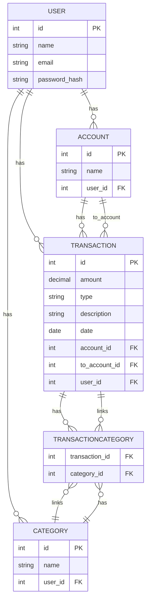

# Database Diagram

```mermaid
erDiagram
    USER ||--o{ ACCOUNT : has
    USER ||--o{ CATEGORY : has
    USER ||--o{ TRANSACTION : has
    ACCOUNT ||--o{ TRANSACTION : has
    CATEGORY ||--o{ TRANSACTIONCATEGORY : has
    TRANSACTION ||--o{ TRANSACTIONCATEGORY : has
    TRANSACTIONCATEGORY }o--|| CATEGORY : links
    TRANSACTIONCATEGORY }o--|| TRANSACTION : links
    TRANSACTION }o--|| ACCOUNT : to_account

    USER {
        int id PK
        string name
        string email
        string password_hash
    }
    ACCOUNT {
        int id PK
        string name
        int user_id FK
    }
    CATEGORY {
        int id PK
        string name
        int user_id FK
    }
    TRANSACTION {
        int id PK
        decimal amount
        string type
        string description
        date date
        int account_id FK
        int to_account_id FK
        int user_id FK
    }
    TRANSACTIONCATEGORY {
        int transaction_id FK
        int category_id FK
    }
```

This diagram represents the main entities and relationships in the database, based on the backend models.
